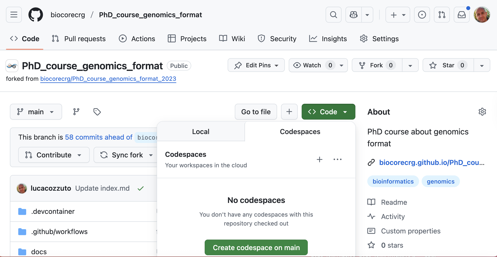

# GitHub codespace

GitHub allows us to use a virtual environment for playing with the code and data stored in this repository. 

First, you need to subscribe to GitHub if you don't have an account. You can do it by clicking [here](https://github.com/signup?source=login)

Then you can go to the repository and click on **Codespace** and click on **Create codespace on main**.  

 

