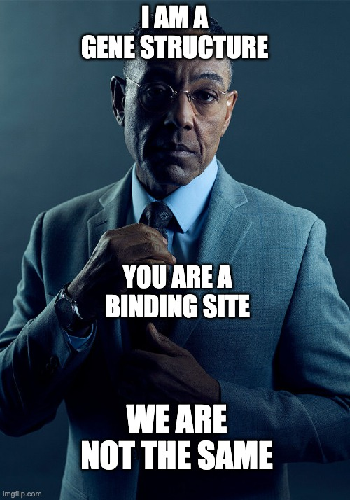

# Formats in Bioinformatics

## Why so many formats?

This is a typical question each time I give this course... so there are mainly two reasons:

## Different data types

In biology we have plenty of entities, elemements and values that need to be described. Expression values, gene structures, genomic annotations, functional elements... All of them often requires a specialized **data format**.



## "My format is better than your" syndrome

Each time a new problem arises in biology, bionformaticians try to use an already described data format.
<br>

But sometimes is not enough for describing completely the new kind of data and so they tend to accumulate...
<br>
<br>


```{bioschemas} ./bioschemas.yaml

```
